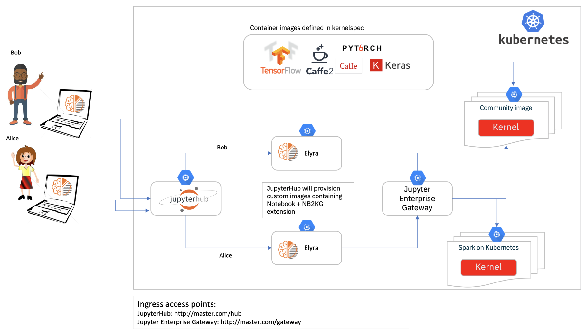

# Deploy a self-service Notebook environment on Kubernetes cluster

This repository defines multiple [Ansible Roles](https://www.ansible.com/) to help deploying and configuring
a Kubernetes cluster with [JupyterHub](https://github.com/jupyterhub/jupyterhub),
[Jupyter Enterprise Gateway](https://github.com/jupyter/enterprise_gateway) and
[Elyra](https://github.com/elyra-ai/elyra) extensions to 
[JupyterLab Notebooks](https://github.com/jupyterlab/jupyterlab).



# Requirements

You will need a driver machine with ansible installed and a clone of the current repository:

* If you are running on cloud (public/private network)
  * Install ansible on the edge node (with public ip)
* if you are running on private cloud (public network access to all nodes)
  * Install ansible on your laptop and drive the deployment from it

### Installing Ansible on RHEL

```
curl -O https://dl.fedoraproject.org/pub/epel/epel-release-latest-7.noarch.rpm
sudo rpm -i epel-release-latest-7.noarch.rpm
sudo yum update -y
sudo yum install -y  ansible
```

### Installing Ansible on Mac

* Install Annaconda
* Use pip install ansible

```
pip install --upgrade ansible
```

### Updating Ansible configuration

In order to have variable overriding from host inventory, please add the following configuration into your ~/.ansible.cfg file

```
[defaults]
host_key_checking = False
hash_behaviour = merge
command_warnings = False
```

### Supported/Tested Platform

* RHEL 7.x
* Ansible 2.10.3

# Deployment

## Available deployment Ansible Roles
* **common:** Basic OS updates and configurations common to all scenarios
* **kubernetes:** Basic Kubernetes platform and utilities required to run either Jupyter or Spark environments
* **jupyter-enterprise-gateway:** Deploy necessary images for Jupyter Enterprise Gateway and supported kernels
* **jupyterhub:** Deploy JupyterHub environment using custom Notebook image for remote kernels (using Enterprise Gateway)


## Defining deployment metadata (host inventory)

Ansible uses 'host inventory' files to define the cluster configuration, nodes, and groups of nodes
that serves a given purpose (e.g. master node, worker nodes, etc).

Below is a host inventory sample definition:

```
[all:vars]

[master]
lresende-kube-node-1   ansible_host=9.30.109.214   ansible_host_private=172.16.186.211

[nodes]
lresende-kube-node-2   ansible_host=9.30.123.95   ansible_host_private=172.16.202.136
lresende-kube-node-3   ansible_host=9.30.188.28   ansible_host_private=172.16.202.144
lresende-kube-node-4   ansible_host=9.30.188.36   ansible_host_private=172.16.203.8
lresende-kube-node-5   ansible_host=9.30.188.38   ansible_host_private=172.16.210.6
```

## Deployment of Kubernetes and a self-service notebook environment 

The sample `setup-kubernetes.yml` playbook deploys a Kubernetes cluster and configure JupyterHub
and Elyra extensions to JupyterLab Notebooks.

```yaml
- name: setup kubernetes
  hosts: all
  remote_user: root
  roles:
    - role: common
    - role: kubernetes
    - role: jupyter-enterprise-gateway
    - role: jupyterhub
```

### Deploying

```
ansible-playbook --verbose <deployment playbook.yml> -i <hosts inventory>
```

Example:

```
ansible-playbook --verbose setup-kubernetes.yml -c paramiko -i hosts-fyre-kubernetes
```


